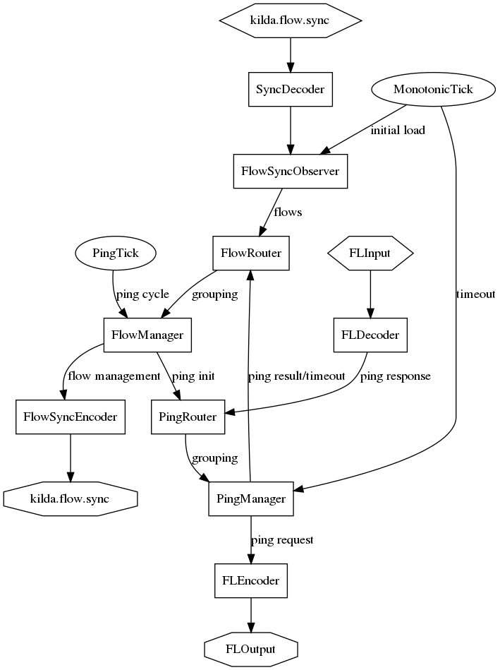

# Flow ping topology

The main goal of flow ping topology is to continuously check all existing in 
system flow's health. To check flows health special verification packet is 
created and send from one "end" of the flow to other end (same in opposite 
direction). This packet is roted in same way as the customer traffic - using 
install OFRules. At the last/edge switch this packet is cached and validated.

If packet pass validation - measurement info is extracted from it and used to
measure flow parameters.

The produced from this "pings" data can be used to determine issues with 
customer traffic. Also it can be used as "second" health check for network
topology. It allow to determine issues on "data plane".

## Schema of ping topology

The topology can be "divided" on 3 branches
* Populate flows cache and keep it updated 
* Periodic ping request generation
* Process "ping" responses and lack of responses (ping timeouts)

### FlowSync
Kafka spout that consume `kilda.flow.sync`. This topic provide flows update 
events stream in "real-time".
 
### SyncDecoder
Decode stream messages from external format (JSON).

### FlowSyncObserver
This bolt serve two purposes. First - initial flows fetch from DB. Second 
aggregate events from `kilda.flow.sync` and produce create/update/delete events 
for `FlowManager`. We must not have more than 1 instance of this bolt i.e no 
parallelism here. 

### FlowRouter
Proxy messages to `FlowManager`. Required to correct work of "fields grouping" 
by `flow_id` field.

### FlowManager
Keep active flows and their "status". Main orchestration point of flow pings.
By "signal" from `PingTick` (use "all grouping" subscription) produce ping 
request for all "pingable" flows.

Use "fields grouping" by "flow_id" field subscription to be able to run in 
parallel.

Produce `flow management` events - stream with flow health info.

### PingRouter
Proxy messages to `PingManager` to be able to use "fields grouping" by ping 
`package_id` field.

### PingManager
Manage active at this moment pings. Consume ping responses from `FLInput` and 
time ticks from `MonotonicTick`. Produce "ping results/timeouts" and send them
into `FlowManager`

Use "fields grouping" by "packet_id" field subscription. It allow to run 
several instances of this bolt in parallel.

### FLEncode
Encode ping request into external format (JSON).

### FLOutput
Kafka bolt that proxy messages into `kilda.speaker` kafka's topic.

### FLInput
Kafka spout that consume message from `kilda.speaker` kafka's topic. This topic
provide ping responses.

### FLDecoder
Decode FL messages from extenal format (JSON)

### FlowManagementEncoding
Encode management message into external format (JSON)

### FlowManagement
Kafka bolt that proxy messages into `kilda.flow.management`.

### PingTick
Produce periodic event (time tick). Used to trigger next generation of flow
pings.

### MonotonicTick
Produce periodic events (time tick). Used to trigger delayed validation
(timeouts) in ping operation (mostly).
